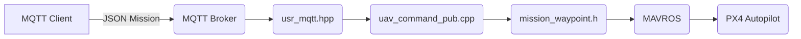

# MQTT 航点任务接口规范 / Waypoint-Mission over MQTT

## 概述
本系统支持通过MQTT动态发送航点数据到MAVROS航点任务系统，航点格式与传统MAVROS保持一致。

## MQTT消息格式

## 目录 / Table of Contents
1. [概述 / Overview](#概述--overview)
2. [MQTT 主题 & QoS](#mqtt-主题--qos)
3. [JSON 数据结构 / JSON Schema](#json-数据结构--json-schema)
4. [字段详解 / Field Reference](#字段详解--field-reference)
5. [完整示例 / Mission Samples](#完整示例--mission-samples)
6. [Python 发布示例 / Python Publish Example](#python-发布示例--python-publish-example)
7. [工作流程 / Workflow](#工作流程--workflow)
8. [注意事项 / Notes](#注意事项--notes)
9. [故障排除 / Troubleshooting](#故障排除--troubleshooting)

---

## 概述 / Overview
通过 MQTT 将 **航点任务 (AUTO.MISSION)** 动态下发给 **MAVROS**，实现远程任务更新。消息体沿用 MAVLink 航点字段，便于与地面站/QGC 等工具互通。

## MQTT 主题 & QoS
| 方向 / Direction | 主题 / Topic | 建议 QoS |
|------------------|-------------|---------|
| 下行 → UAV | `uavcontrol/command/<uav_id>` | 1 |
| 上行 ← UAV | `uavcontrol/state/<uav_id>`   | 0 |

*`<uav_id>` 通常使用机体编号，如 `uav1`、`uav2` 等。*

## JSON 数据结构 / JSON Schema
```json
{
  "command": {
    "Mission": 1,
    "Waypoints": [ waypoint_object, ... ]
  }
}
```
字段说明：
* **Mission**：`1` = 执行任务，`0` / 其它 = 预留 (可用于取消任务等)。
* **Waypoints**：航点数组，元素结构见下。

### waypoint_object
```json
{
  "frame": 1,
  "command": 16,
  "x": 0.0,
  "y": 0.0,
  "z": -3.0,
  "param1": 0.0,
  "param2": 0.0,
  "param3": 0.0,
  "param4": 0.0
}
```

## 字段详解 / Field Reference
### frame (uint8)
| 值 | MAV_FRAME | 描述 / Description |
|----|-----------|-------------------|
| 0  | GLOBAL                  | 地球 WGS-84 坐标 / WGS-84 absolute |
| 1  | LOCAL_NED              | 本地 NED / Local NED |
| 3  | GLOBAL_RELATIVE_ALT    | 全球相对高度 / Relative alt |
| 4  | LOCAL_ENU _(PX4)_      | 本地 ENU |

### command (uint16)
| 值 | MAV_CMD | 中文 / CN | EN |
|----|---------|-----------|----|
| 16 | NAV_WAYPOINT | 导航航点 | Waypoint |
| 21 | NAV_LAND     | 降落     | Land |
| 22 | NAV_TAKEOFF  | 起飞     | Takeoff |
| 84 | VTOL_TAKEOFF | 垂直起飞 | VTOL takeoff |

### 位置坐标 / Position (x,y,z)
在 **LOCAL_NED** 模式下：
* `x` 北向 + (m)
* `y` 东向 + (m)
* `z` 下向 + (m)，**负值代表高度**

在 **GLOBAL** 模式下：
* `x`=纬度(°) `y`=经度(°) `z`=高度(m)

### param
a) NAV_WAYPOINT (#16)
* `param1` 悬停时间 / Hold time (s)
* `param2` 接受半径 / Acceptance radius (m)
* `param3` 通过半径 / Pass radius (m)
* `param4` 偏航角 / Yaw angle (deg)

b) NAV_TAKEOFF (#22)
* `param1` 最小俯仰角 / Min pitch (deg)
* `param2` 保留 / Unused
* `param3` 保留 / Unused
* `param4` 偏航角 / Yaw (deg)

c) NAV_LAND (#21)
* `param1` 中止高度 / Abort alt (m)
* `param2` 精确降落模式 / Precision land mode
* `param3` 保留 / Unused
* `param4` 偏航角 / Yaw (deg)


## 完整示例 / Mission Samples
### 示例 1: 起飞 → 2 航点 → 降落 / Takeoff-Waypoints-Land
```json
{
  "command": {
    "Mission": 1,
    "Waypoints": [
      {
        "frame": 1,
        "command": 84,
        "x": 0.0,
        "y": 0.0,
        "z": -3.0,
        "param1": 0.0,
        "param2": 0.0,
        "param3": 0.0,
        "param4": 0.0
      },
      {
        "frame": 1,
        "command": 16,
        "x": 10.0,
        "y": 0.0,
        "z": -3.0,
        "param1": 5.0,
        "param2": 2.0,
        "param3": 0.0,
        "param4": 0.0
      },
      {
        "frame": 1,
        "command": 16,
        "x": 10.0,
        "y": 10.0,
        "z": -3.0,
        "param1": 5.0,
        "param2": 2.0,
        "param3": 0.0,
        "param4": 90.0
      },
      {
        "frame": 1,
        "command": 16,
        "x": 0.0,
        "y": 10.0,
        "z": -3.0,
        "param1": 3.0,
        "param2": 2.0,
        "param3": 0.0,
        "param4": 180.0
      },
      {
        "frame": 1,
        "command": 21,
        "x": 0.0,
        "y": 0.0,
        "z": 0.0,
        "param1": 0.0,
        "param2": 0.0,
        "param3": 0.0,
        "param4": 0.0
      }
    ]
  }
}
```

### 示例2：高度变化的3D航点任务
```json
{
  "command": {
    "Mission": 1,
    "Waypoints": [
      {
        "frame": 1,
        "command": 84,
        "x": 0.0,
        "y": 0.0,
        "z": -2.0,
        "param1": 0.0,
        "param2": 0.0,
        "param3": 0.0,
        "param4": 0.0
      },
      {
        "frame": 1,
        "command": 16,
        "x": 5.0,
        "y": 5.0,
        "z": -5.0,
        "param1": 8.0,
        "param2": 1.5,
        "param3": 0.0,
        "param4": 45.0
      },
      {
        "frame": 1,
        "command": 16,
        "x": -5.0,
        "y": 5.0,
        "z": -3.0,
        "param1": 6.0,
        "param2": 1.5,
        "param3": 0.0,
        "param4": 135.0
      },
      {
        "frame": 1,
        "command": 16,
        "x": 0.0,
        "y": 0.0,
        "z": -2.0,
        "param1": 3.0,
        "param2": 1.0,
        "param3": 0.0,
        "param4": 0.0
      },
      {
        "frame": 1,
        "command": 21,
        "x": 0.0,
        "y": 0.0,
        "z": 0.0,
        "param1": 0.0,
        "param2": 0.0,
        "param3": 0.0,
        "param4": 0.0
      }
    ]
  }
}
```

## 工作流程 / Workflow


1. **发送MQTT消息**：将航点数据发送到主题 `uavcontrol/command/uav1`
2. **触发任务**：在终端输入 `8` 触发航点任务
3. **系统判断**：
   - 如果收到MQTT航点 → 使用MQTT航点执行MAVROS任务
   - 如果没有MQTT航点 → 使用预定义航点执行任务
4. **任务执行**：系统使用AUTO.MISSION模式执行航点任务

## 注意事项

1. **坐标系统**：建议使用FRAME_LOCAL_NED (frame=1) 本地坐标系
2. **高度表示**：z轴负值表示高度 (NED坐标系)
3. **航点顺序**：第一个航点建议为起飞指令 (command=84)
4. **最后航点**：最后一个航点建议为降落指令 (command=21)
5. **参数检查**：确保每个航点包含所有9个参数
6. **实时性**：MQTT航点数据在触发任务前发送

## 系统架构


